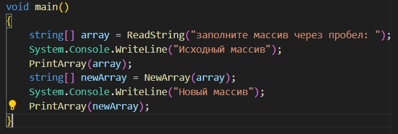
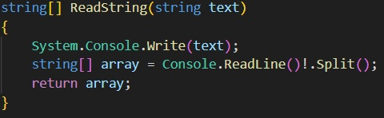
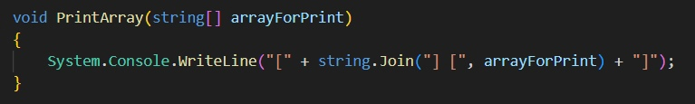
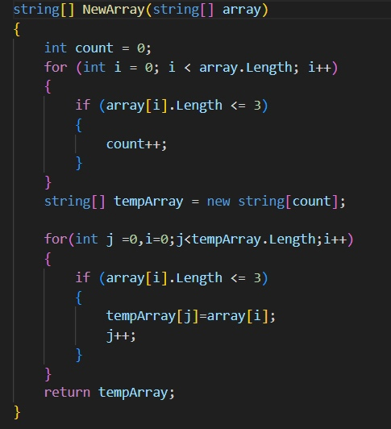
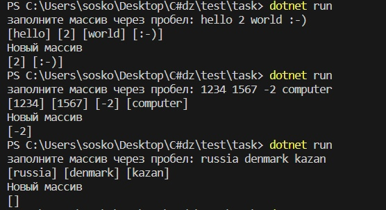

# Итоговая контрольная работа по основному блоку

**Выполнил Бурлаков Иван**

**Работа выполнена на языке `C#`**

##  Методы
`void main()`- Основной метод

`string[] ReadString`- Чтение строки из консоли и преобразование ее в массив(исходный) через заданный разделитель (пробел)

`void PrintArray`- Красивый вывод массива с помощью метода `string.Join` с заданным разделителем 

`string[] NewArray`- генерация нового массива со случайным кол-во элементов(от 0 до 3) и заполнение его случайными не повторяющимися элементами из исходного массива

## Примеры выполнения

## Блок схема

